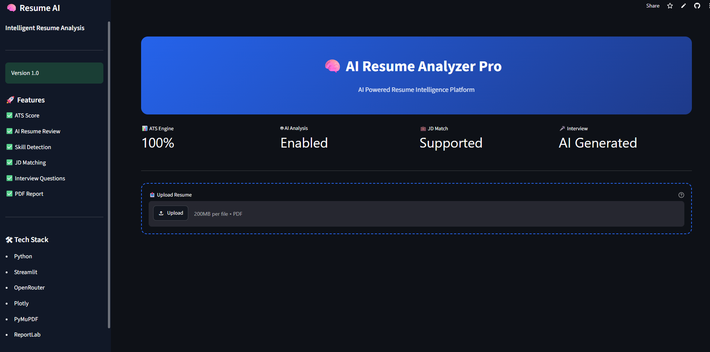
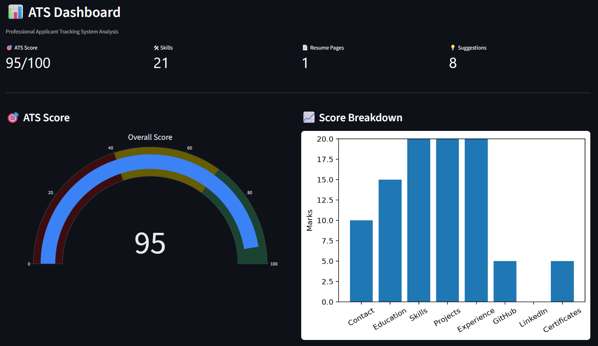
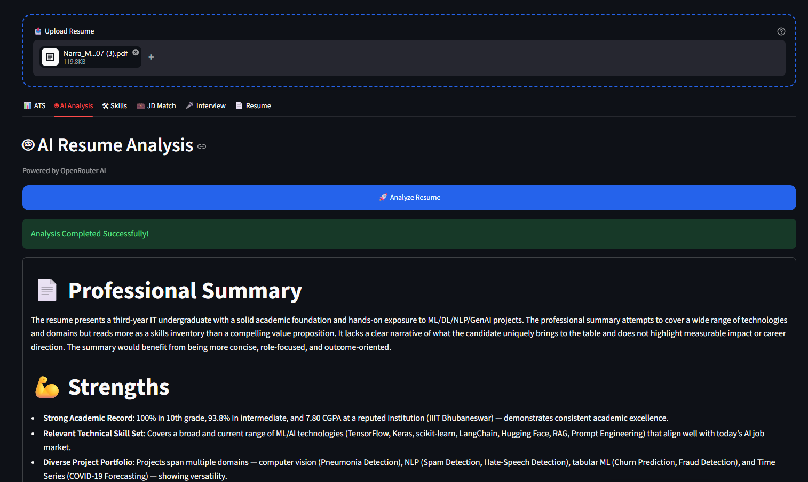
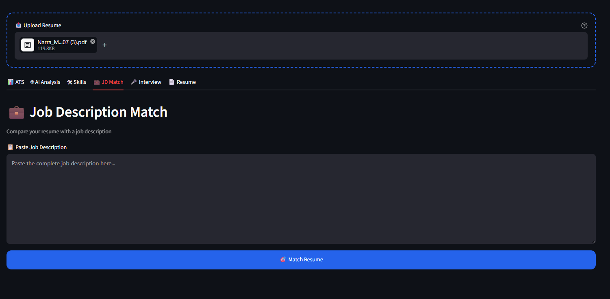
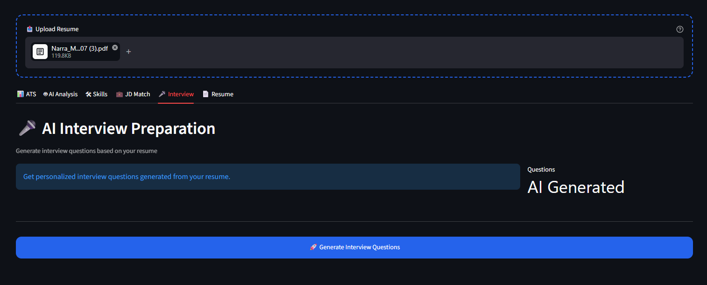
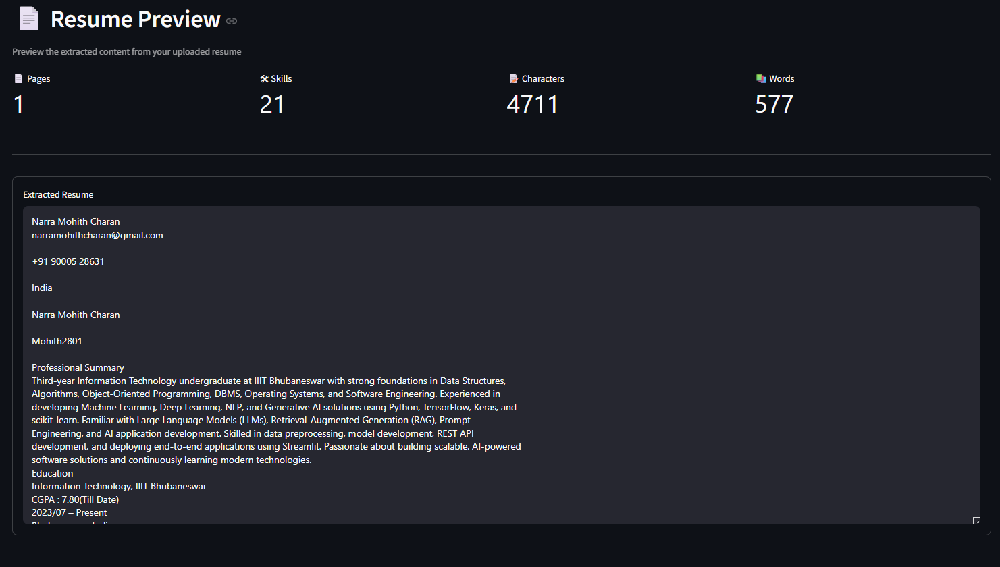

<div align="center">

# 🚀 AI Resume Analyzer Pro

### An AI-powered Resume Analyzer that evaluates resumes with ATS scoring, AI feedback, Job Description matching, Skill Analysis, Interview Question Generation, and PDF Report Generation.

[](https://www.python.org/)
[](https://streamlit.io/)
[](https://openrouter.ai/)
[](LICENSE)

### 🌐 Live Demo

**https://ai-resume-analyzer-pro-93bpe3rtskst98mh8wdih3.streamlit.app/**

</div>

---

# 📖 Overview

AI Resume Analyzer Pro is an intelligent web application designed to help students and job seekers improve their resumes before applying for internships or full-time roles.

Instead of simply displaying keywords, the application performs a complete resume evaluation using AI and ATS-inspired scoring techniques.

Users receive:

- ATS Score
- Resume Strength Analysis
- AI Feedback
- Missing Skills
- Resume Summary
- Job Description Match Score
- Personalized Interview Questions
- Downloadable PDF Report

---

# ✨ Features

- 📄 Upload Resume (PDF)
- 📊 ATS Score with Detailed Breakdown
- 🤖 AI Resume Analysis
- 💡 Resume Improvement Suggestions
- 🧠 Skill Extraction
- 🎯 Job Description Matching
- ❓ AI Generated Interview Questions
- 📑 Resume Preview
- 📥 Download Professional PDF Report
- 🎨 Modern Responsive Streamlit UI

---

# 🖼️ Application Screenshots

## 🏠 Home Page



---

## 📊 ATS Dashboard



---

## 🤖 AI Resume Analysis



---

## 🎯 Job Description Match



---

## ❓ Interview Questions



---

## 📄 Resume Preview



---

## 🎥 Demo


---

# ⚙️ How It Works

```text
Upload Resume
       │
       ▼
Extract Text from PDF
       │
       ▼
ATS Evaluation
       │
       ├──────────────► Skill Extraction
       │
       ├──────────────► AI Resume Analysis
       │
       ├──────────────► Job Description Matching
       │
       ├──────────────► Interview Question Generation
       │
       ▼
Generate Professional PDF Report
```

---

# 🏗️ Project Structure

```
AI-Resume-Analyzer-Pro/
│
├── assets/
│   └── styles.css
│
├── backend/
│   ├── ai.py
│   ├── ats.py
│   ├── matcher.py
│   ├── parser.py
│   ├── report.py
│   └── skills.py
│
├── images/
│   ├── home.png
│   ├── ats_dashboard.png
│   ├── ai_analysis.png
│   ├── jd_match.png
│   ├── interview.png
│   ├── resume_preview.png
│   └── demo.gif
│
├── uploads/
│
├── app.py
├── requirements.txt
├── README.md
└── LICENSE
```

---

# 🧠 Technologies Used

| Category | Technologies |
|-----------|--------------|
| Language | Python |
| Frontend | Streamlit |
| AI Model | OpenRouter AI |
| PDF Parsing | PyMuPDF |
| Data Processing | Pandas, NumPy |
| ATS Logic | Custom Python |
| Visualization | Plotly |
| PDF Report | ReportLab |
| Version Control | Git & GitHub |

---

# 🚀 Installation

Clone the repository

```bash
git clone https://github.com/Mohith2801/AI-Resume-Analyzer-Pro.git
```

Go to project

```bash
cd AI-Resume-Analyzer-Pro
```

Create virtual environment

```bash
python -m venv venv
```

Activate

### Windows

```bash
venv\Scripts\activate
```

### Linux / macOS

```bash
source venv/bin/activate
```

Install dependencies

```bash
pip install -r requirements.txt
```

Create a `.env` file

```env
OPENROUTER_API_KEY=your_api_key_here
```

Run

```bash
streamlit run app.py
```

---

# 📊 Application Workflow

```
Resume PDF
      │
      ▼
PDF Parser
      │
      ▼
Text Extraction
      │
      ▼
ATS Engine
      │
      ▼
Skill Extraction
      │
      ▼
OpenRouter AI
      │
      ▼
Resume Analysis
      │
      ▼
JD Matching
      │
      ▼
Interview Questions
      │
      ▼
PDF Report
```

---

# 💼 Use Cases

- College Placements
- Resume Optimization
- Internship Preparation
- AI Resume Review
- ATS Compatibility Checking
- Technical Interview Preparation

---

# 🔮 Future Improvements

- Resume Ranking
- Multi-language Support
- Multiple Resume Comparison
- Resume Templates
- AI Cover Letter Generator
- LinkedIn Profile Analysis
- Resume Version History
- Authentication System

---

# 🤝 Contributing

Contributions are welcome!

1. Fork the repository

2. Create a new branch

```bash
git checkout -b feature-name
```

3. Commit changes

```bash
git commit -m "Added new feature"
```

4. Push

```bash
git push origin feature-name
```

5. Open a Pull Request

---

# ⭐ Support

If you found this project useful,

⭐ Star the repository

🍴 Fork the repository

📢 Share it with others

---

# 👨‍💻 Author

**Narra Mohith Charan**

B.Tech Information Technology

IIIT Bhubaneswar

GitHub:

https://github.com/Mohith2801

---

<div align="center">

### ⭐ If you like this project, don't forget to Star the Repository ⭐

Made with ❤️ using Python, Streamlit & AI

</div>
